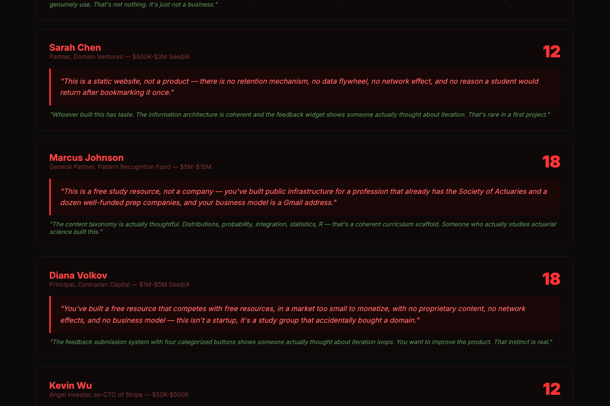

# vibestack

**From idea to roasted MVP in one session.**

Three commands. Zero hand-holding. Your prototype gets built autonomously, then brutally evaluated by evolving AI critics who scrape Reddit for real user opinions and check your GitHub to see if you're bluffing.

```
/vibe-prep      →  Validate idea, write PRD, design UI, scaffold
/vibe-harness   →  15 autonomous coding cycles with live dashboard
/roast-mvp      →  Evolving VC panel + real community personas destroy your MVP
```




---

## 5-Minute Demo

```bash
# Install (one time)
git clone https://github.com/jincinga24-hue/vibestack.git
cd vibestack && bash install.sh

# In Claude Code — run the pipeline
/vibe-prep                    # walks you through idea → PRD → UI → scaffold
/vibe-harness                 # builds it autonomously (15 cycles)
/roast-mvp                    # brutally roasts the result

# Or roast any live URL directly
roastmymvp run https://your-app.com --mode gauntlet --real -n 20
```

**What a VC roast looks like:**

```
🔥 STAGE 1: VC ROAST PANEL 🔥

❌ Richard Zhao (Ruthless Capital): 8/100 — PASS
   Kill shot: "You built a free resource for a shrinking audience of
   ~30,000 students globally, with no monetization model — this isn't
   a startup, it's a study group that accidentally bought a domain."
   Grudging praise: "718ms load, zero JS errors. You ship. Most people don't."

❌ Sarah Chen (Domain Ventures): 12/100 — PASS
   Kill shot: "This is a static website, not a product — there is no
   retention mechanism, no data flywheel, no network effect."

🧬 Evolved VC (Gen 3) — Natural Selection Capital: 12/100
   Kill shot: "This is a homework project you forgot to take down."

💀 DESTROYED. Score: 14/100
```

**What community feedback looks like:**

```
Verdict: NO-GO | Download: 0% | Pay: 0% | Return: 40% | UX: 5.5/10

Top Friction Points:
- 47 of 53 navigation buttons hidden on load
- Search is hidden — the core feature is invisible
- "RStudio Basics — coming soon" listed as complete section
- "© 2025" in footer signals abandonment

What They Respected:
- 695ms load, zero JS errors, 316KB total
- Content taxonomy maps perfectly to actuarial syllabi
- "Whoever built this knows the domain. That's not nothing."
```

---

## How It's Different

| | gstack | vibestack |
|---|---|---|
| **Focus** | Code review & QA roles | Full pipeline: idea → build → roast |
| **Writing code** | You write, it reviews | It writes autonomously (15 cycles) |
| **Product validation** | Manual review skills | Evolving AI personas + real Reddit data |
| **Gets better over time** | Static skills | Gene pool evolves — bad critics die |
| **Researches you** | No | Scrapes your GitHub, catches bluffs |

**vibestack complements gstack** — install both. Use gstack for `/review`, `/qa`, `/ship`, `/browse`. Use vibestack for the full idea-to-roast pipeline.

---

## The Gauntlet

```
┌──────────────────┐     ┌───────────────────┐     ┌──────────────────┐
│  STAGE 1: VC 🔥   │────▶│ STAGE 2: COMMUNITY│────▶│   CERTIFIED ✅    │
│                  │     │                   │     │                  │
│ 5 evolved VCs    │     │ 20 real personas  │     │ GOOD or GREAT    │
│ Research founder │     │ from Reddit/HN    │     │                  │
│ Score >= 40 to   │     │ PMF signals       │     │ PDF report       │
│ pass             │     │ GO/NO-GO          │     │ generated        │
│                  │     │                   │     │                  │
│ FAIL = LOCKED 🔒  │     │ FAIL = 😤         │     │ PASS = 🏆        │
└──────────────────┘     └───────────────────┘     └──────────────────┘
```

If your product can't survive 5 AI VCs, it's not ready for real users.
If it survives VCs but fails community testing, your UX needs work.
If it passes both — ship it.

---

## Evolution Engine

Inspired by [EvoMap's Genome Evolution Protocol](https://evomap.ai/).

The VCs aren't static. They **evolve**.

```
Run roast → Rate critiques → Gene fitness updates → Evolve
    ↑                                                  │
    └─── Next run uses evolved critics ────────────────┘
```

- **Kill**: Bottom 20% fitness → dead, replaced by offspring
- **Mutate**: Mid-tier genes get sharper kill questions
- **Crossover**: Top 2 breed to create "Evolved VC (Gen N)"
- **Persist**: Gene pool survives between runs in `memory/genes/`

```bash
roastmymvp pool        # 🧬 25 alive, 1 dead, gen 3, avg fitness 0.51
roastmymvp feedback    # Rate last run's critiques
roastmymvp evolve      # Kill weak, mutate mid, breed top
```

---

## Founder Profiling

VCs don't just look at your product. They **research you**.

```bash
roastmymvp run https://app.com --mode vc --github https://github.com/you
```

```
🔍 Researching founder...
   ✅ Founder is technical: 13 repos, 56K stars
   ⚠️  Recent activity: only 1 day — "Are you building this or just talking about it?"
   ✅ Languages: Ruby, JavaScript, TypeScript
```

The VCs reference this intel in their roasts. If you claim "years of experience" but your GitHub is 6 months old, they'll catch it.

---

## Install

### Prerequisites

- [Claude Code](https://claude.ai/code) installed
- [gstack](https://github.com/garrytan/gstack) installed (recommended)
- Python 3.12+

### Quick Install

```bash
git clone https://github.com/jincinga24-hue/vibestack.git
cd vibestack
bash install.sh
```

### What Gets Installed

**4 skills** (slash commands for Claude Code):

| Skill | What it does |
|-------|-------------|
| `/validate-idea` | 6-step idea stress test before you write a line of code |
| `/vibe-prep` | Interactive: idea → PRD → UI design → project scaffold |
| `/vibe-harness` | Autonomous: 15 coding cycles with live dashboard |
| `/roast-mvp` | Brutal: evolving VCs + real Reddit personas roast your MVP |

**roastmymvp CLI** (the roast engine):

| Feature | Description |
|---------|-------------|
| Browser agent | Playwright crawls your site, extracts visible text, finds elements |
| 5 VC personas | Shark, domain expert, pattern matcher, devil's advocate, angel |
| Gene pool | VCs evolve — bad critics die, good ones breed (GEP-inspired) |
| Real personas | Built from actual Reddit/HN comments, not generic templates |
| Founder profiling | Scrapes your GitHub, cross-references pitch claims, catches bluffs |
| PDF reports | Visual reports with scores, kill shots, UX bars, action plans |

**Also recommended:**
- [gstack](https://github.com/garrytan/gstack) — adds `/review`, `/qa`, `/ship`, `/browse` (code quality + QA)
- [Everything Claude Code](https://github.com/nicobailey/everything-claude-code) — adds 65+ engineering pattern skills

---

## CLI Reference

```bash
roastmymvp run <URL> [options]   # Run a roast
roastmymvp evolve                # Evolve the gene pool
roastmymvp feedback [run_id]     # Rate critiques
roastmymvp pool                  # Gene pool status
```

| Flag | What it does |
|------|-------------|
| `--mode vc\|community\|gauntlet` | Testing mode |
| `--real` | Build personas from real Reddit/HN users |
| `-n 20` | Number of personas |
| `--github <url>` | Founder's GitHub (VCs research you) |
| `--pitch "<text>"` | Elevator pitch for VC mode |
| `-t "<topic>"` | Search terms for real users |
| `-s "<subreddit>"` | Specific subreddits to scrape |
| `--competitor "<name>"` | Competitor for research |

---

## Credits

- [gstack](https://github.com/garrytan/gstack) by Garry Tan — the skill pack that started it all
- [EvoMap](https://evomap.ai/) — Genome Evolution Protocol inspiration
- [Everything Claude Code](https://github.com/nicobailey/everything-claude-code) — engineering skill pack
- Shanghai EvoMap hackathon team — Agent VC concept
- Claude Code by Anthropic

## License

MIT — fork it, improve it, make it yours.
