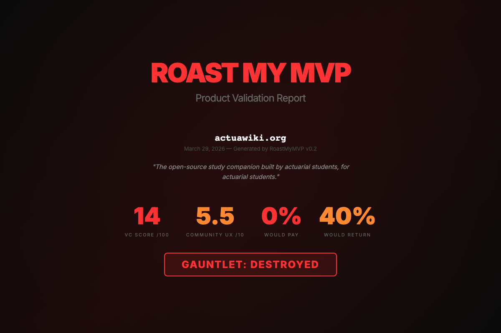

# vibestack

**Go from "I have an idea" to a deployed, monitored MVP — without writing code yourself.**

vibestack is a set of 5 commands for [Claude Code](https://claude.ai/code) (Anthropic's AI coding tool). Type `/vibe` and it walks you through a 9-stage pipeline: validate your idea, design it, plan it, build it with TDD, QA it, get it roasted by AI personas, ship it, and monitor it.

You can also run each stage individually if you prefer.

Here's what the honest feedback looks like:

```
Verdict: NO-GO | UX: 5.5/10

Top Issues:
- 47 of 53 navigation buttons hidden on load — users can't find anything
- Search bar is hidden — the core feature is invisible
- "Coming soon" section listed alongside finished ones — feels incomplete

What They Liked:
- 695ms load time — genuinely fast
- Zero JS errors
- "Whoever built this knows the domain. That's not nothing."

Fix These First:
1. Show search on the landing page
2. Remove incomplete sections
3. Update the copyright year
```

That's from real AI personas testing a real site. Not generic advice — specific issues you can fix today.



---

## Before You Start

You need two things:

1. **Claude Code** — Anthropic's AI coding tool that runs in your terminal
   - Install: `npm install -g @anthropic-ai/claude-code`
   - Or download from [claude.ai/code](https://claude.ai/code)
   - This is what you'll actually type commands into

2. **Python 3.12+** — needed for the roast engine
   - Check: `python3 --version`
   - Mac: `brew install python` (if you don't have it)
   - Windows: download from [python.org](https://python.org)

**Don't have Claude Code yet?** Get it first. vibestack is a set of tools that run inside it.

---

## Install vibestack

```bash
git clone https://github.com/jincinga24-hue/vibestack.git
cd vibestack
bash install.sh
```

The installer copies 5 slash commands into Claude Code and sets up the roast engine. Takes about 60 seconds.

---

## How to Use It

Open your terminal. Navigate to an empty folder (or an existing project). Start Claude Code:

```bash
mkdir my-new-project && cd my-new-project
claude
```

You're now in Claude Code. It looks like a chat in your terminal. This is where you type the slash commands.

### The Easy Way: `/vibe`

Type:
```
/vibe
```

This is the **unified pipeline**. It shows you a 9-stage menu and walks you through everything:

```
/vibe

Pipeline: New Project
Status: Fresh — no pipeline state found

  1. Validate        [pending]  <-- start here
  2. Brainstorm       [pending]
  3. Vibe Prep        [pending]
  4. Plan             [pending]
  5. Build            [pending]
  6. QA + Design      [pending]
  7. Roast            [pending]
  8. Ship             [pending]
  9. Monitor          [pending]

> Enter stage number, or press Enter to start from stage 1:
```

Each stage invokes the right skill automatically. Progress is saved in `VIBE-STATE.md` so you can stop and resume anytime. You can jump to any stage from the menu.

**What happens at each stage:**

| Stage | What It Does | Time |
|-------|-------------|------|
| 1. Validate | YC-style forcing questions + structured idea validation | 5-10 min |
| 2. Brainstorm | Design spec with multiple approaches explored | 10-15 min |
| 3. Vibe Prep | PRD, UI design, architecture, project scaffold | 10-15 min |
| 4. Plan | Detailed implementation plan with TDD steps | 5-10 min |
| 5. Build | Autonomous 15+ cycle coding with TDD + code review every cycle | 30-60 min |
| 6. QA + Design | Browser-based QA testing + visual polish | 10-20 min |
| 7. Roast | AI personas stress-test your MVP (auto-loops to Build if score < 6) | 5-10 min |
| 8. Ship | Create PR + deploy | 5 min |
| 9. Monitor | Continuous canary monitoring until you stop it | Ongoing |

**Key features:**
- TDD and code review injected into every build cycle
- Roast auto-loops back to Build if score is below 6/10
- Integrates with [gstack](https://github.com/garrytan/gstack) for QA, design review, shipping, and monitoring
- Integrates with [superpowers](https://github.com/obra/superpowers) for brainstorming, planning, and TDD

---

### Or Run Steps Individually

If you prefer to run stages manually, here are the individual commands:

### Step 1: "Should I build this?"

Type:
```
/validate-idea
```

Claude asks you hard questions:
- What problem are you solving?
- Who has this problem?
- What do they do today without your product?
- Why would they switch?

It's trying to stop you from building something nobody wants. At the end, you get a `VALIDATION-REPORT.md` with a go/no-go recommendation.

**Takes about 5-10 minutes of back-and-forth.**

### Step 2: "Let's plan it"

Type:
```
/vibe-prep
```

Claude walks you through:
1. Writing a PRD — what you're building, what you're NOT building
2. Designing the UI — pages, layout, what goes where
3. Scaffolding the project — folders, dependencies, boilerplate

It asks your opinion at every step. Nothing gets finalized without you saying "yes".

**Takes about 10-15 minutes. You end up with `docs/PRD.md`, `docs/UI-DESIGN.md`, and a project ready to code.**

### Step 3: "Build it for me"

Type:
```
/vibe-harness
```

Now Claude codes autonomously. It:
1. Reads the PRD and UI design you just approved
2. Writes code
3. Tests if it works
4. Fixes issues
5. Repeats (up to 15 cycles)

A live dashboard opens in your browser showing progress. You can watch or go make coffee.

**Takes 20-60 minutes depending on complexity. You end up with a working prototype.**

### Step 4: "Is it any good?"

Type:
```
/roast-mvp
```

Claude opens your site in a browser, reads what users would see, and runs simulated users against it. Each persona has different patience, tech level, and expectations. They give honest feedback.

**Takes 5-10 minutes. You get a report with specific issues and what to fix first.**

---

## That's the whole workflow

**Unified (recommended):**
```
/vibe             →  Full 9-stage pipeline with menu  (1-2 hours total)
```

**Individual commands:**
```
/validate-idea    →  Should I build this?           (5 min)
/vibe-prep        →  Plan it properly               (10 min)
/vibe-harness     →  Build it autonomously           (20-60 min)
/roast-mvp        →  Get honest feedback             (5 min)
```

You can also skip steps:
- **Have an existing project?** Type `/vibe` and jump to any stage from the menu
- **Already built something?** Go straight to `/roast-mvp`
- **Just want feedback on a live site?** Use the CLI directly (see below)

---

## FAQ

**Do I need an API key?**
No. vibestack uses your Claude Code subscription. No extra costs.

**Does it cost money?**
Only your Claude Code subscription (which you already have if you installed it).

**What languages/frameworks does it support?**
Anything. It reads your PRD and builds with whatever stack you chose. React, Python, Swift, Go — whatever.

**Can I use it on a project I already started?**
Yes. Skip to `/vibe-harness` (add a `docs/PRD.md` first so it knows what to build) or go straight to `/roast-mvp` to test what you have.

**The harness got stuck / keeps failing on the same bug. What do I do?**
See [docs/HARNESS-GUIDE.md](docs/HARNESS-GUIDE.md). Short answer: let the session end and start a new one. It picks up where it left off.

**Can I roast any website, not just my own?**
Yes:
```bash
cd vibestack/roastmymvp && source .venv/bin/activate
roastmymvp run https://any-website.com
```

**How is this different from just chatting with Claude?**
Claude Code without vibestack is a blank canvas — you have to know what to ask. vibestack gives you a structured process: validate → plan → build → test. Each step feeds into the next.

---

## Going Deeper

Once you've done the basic workflow a few times:

### Roast any URL from the terminal

```bash
cd vibestack/roastmymvp && source .venv/bin/activate

# Community feedback
roastmymvp run https://your-app.com

# VC mode — 5 brutal investors roast your product
roastmymvp run https://your-app.com --mode vc

# Full gauntlet — must survive VCs to unlock community testing
roastmymvp run https://your-app.com --mode gauntlet
```

### Real personas from Reddit

Build test personas from actual Reddit/HN discussions instead of generic ones:

```bash
roastmymvp run https://your-app.com --real -n 20 -t "your topic" -s "relevant_subreddit"
```

### VCs research your GitHub

They'll check if you're bluffing about your experience:

```bash
roastmymvp run https://your-app.com --mode vc --github https://github.com/you
```

### The critics evolve

Rate which feedback was useful. Bad critics die. Good ones breed.

```bash
roastmymvp feedback    # Rate critiques from last run
roastmymvp evolve      # Evolution cycle
roastmymvp pool        # See who survived
```

### Harness engineering

When the autonomous coding loop gets stuck, needs tuning, or you want to understand how it works:

**[docs/HARNESS-GUIDE.md](docs/HARNESS-GUIDE.md)**

### How the evolution engine works

**[docs/EVOLUTION.md](docs/EVOLUTION.md)**

---

## Recommended Companions

The `/vibe` unified pipeline integrates with these tools at stages 2, 4-9. Install them for the full experience:

- **[gstack](https://github.com/garrytan/gstack)** by Garry Tan — QA, design review, shipping, deploy, canary monitoring (stages 6-9)
- **[superpowers](https://github.com/obra/superpowers)** — brainstorming, planning, TDD, code review (stages 2, 4-5)
- **[Everything Claude Code](https://github.com/nicobailey/everything-claude-code)** — 100+ engineering skills

Without these, `/vibe` still works but will skip the stages that require them. The individual commands (`/vibe-prep`, `/vibe-harness`, `/roast-mvp`) work standalone.

---

## Credits

- [gstack](https://github.com/garrytan/gstack) by Garry Tan
- [EvoMap](https://evomap.ai/) — evolution engine inspiration
- [Everything Claude Code](https://github.com/nicobailey/everything-claude-code)
- Claude Code by Anthropic

MIT License
